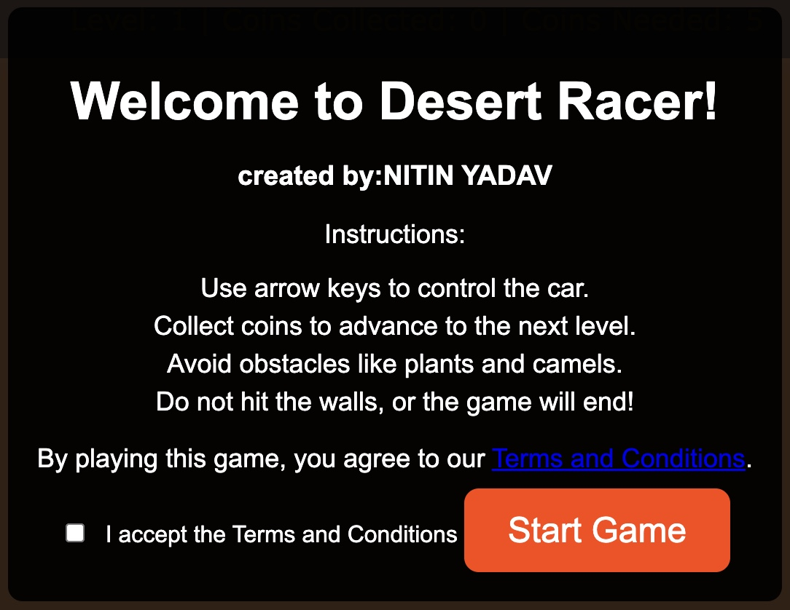
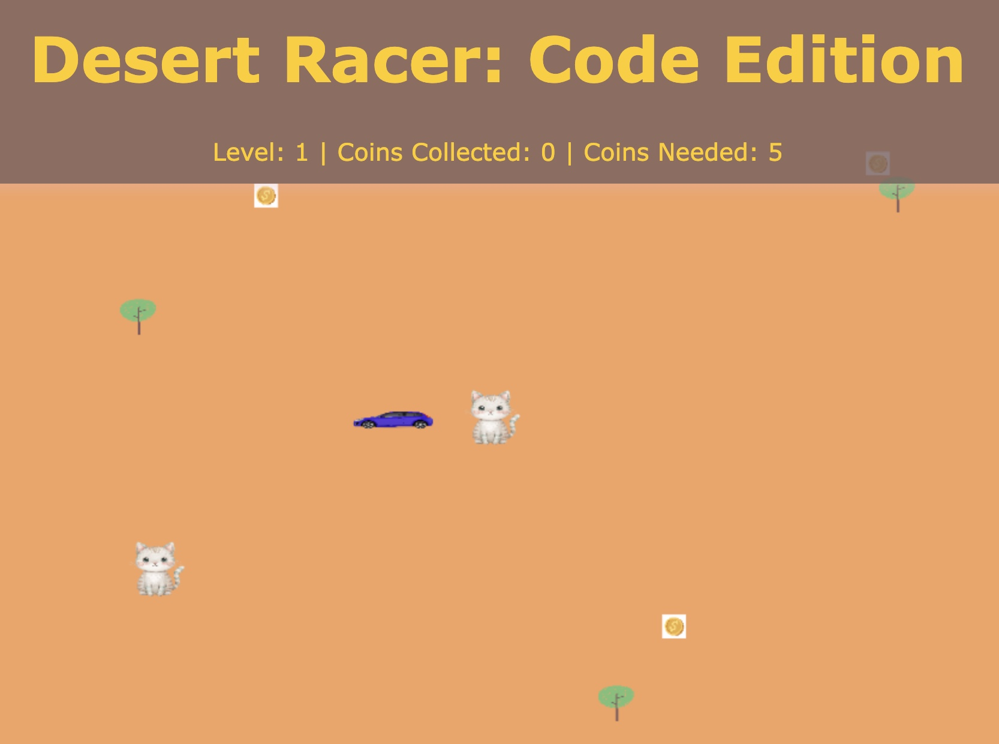
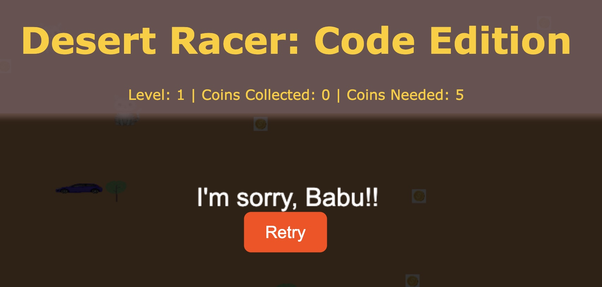
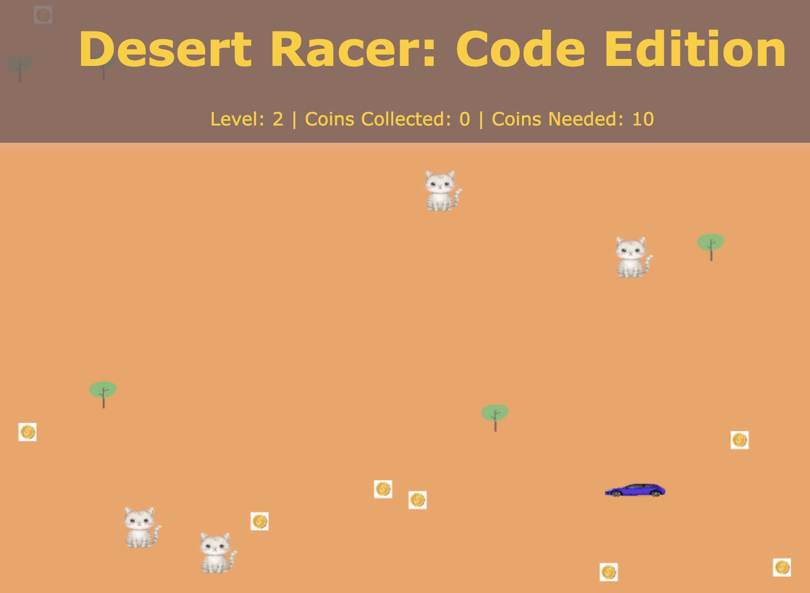

# Desert Racer: Code Edition (2024)

Designed by Nitin Yadav

## Project Overview

Desert Racer: Code Edition is a lightweight, browser-based car racing game built with vanilla JavaScript, HTML, and CSS. It is designed as both a playable game and an educational resource to demonstrate basic game programming concepts: game loop, input handling, collision detection, level progression, asset loading (audio/images), and simple state management.

Key goals:
- Provide an accessible learning example for beginner-to-intermediate JavaScript developers.
- Offer a simple, fun game: collect coins, avoid obstacles, and advance through increasingly difficult levels.
- Be easy to run locally without build tools.

Features
- Smooth car controls (keyboard + on-screen controls for mobile)
- Coin collection and level progression
- Obstacles (plants, camels) with collision detection
- Background music and SFX (coin, crash)
- Responsive layout for desktop and mobile

## Installation & Setup

Requirements
- A modern web browser (Chrome, Firefox, Safari, Edge)
- Git (optional, for cloning)
- macOS Terminal or any terminal for running a simple static server (optional)

Clone the repository
Open Terminal (Mac) and run:
```bash
git clone https://github.com/yourusername/desert-racer-code-edition.git
cd desert-racer-code-edition
```

Open directly in the browser
- Double-click `index.html` in Finder, or from Terminal:
```bash
open index.html
```

Serve via a local static server (recommended for consistent audio behavior)
- Python 3
```bash
python3 -m http.server 8000
# then open http://localhost:8000 in your browser
open http://localhost:8000
```

Ensure audio files are present
Place the following files in the project root (or update paths in `game.js`):
- background.mp3
- coin.mp3
- crash.mp3

Project structure (typical)
- index.html — main game page
- styles.css — styling and responsive layout
- game.js — game logic (controls, collisions, audio)
- assets/ — images / screenshots / audio (optional)

## Usage

Controls
- Desktop: Arrow keys (Left / Right / Up / Down)
- Mobile: On-screen buttons (tap to move)
- Objective: Collect the required number of coins to progress. Avoid obstacles to prevent crashes.

Example playthrough
1. Open the game (index.html or via local server).
2. Accept the terms/instructions on the intro screen.
3. Use arrow keys to navigate the car and collect coins.
4. After collecting the required coins, the next level begins (difficulty increases).

Screenshots









## Development & Testing

- Edit code using VS Code (project available at: /Users/robertpalmer/Desktop copy/Coding/JavaScript/desert-racer.github.io)
- Recommended quick test: run the simple Python server above and open the game in the browser.
- Use the browser DevTools to inspect console logs, debug game loop and collision logic.

Optional enhancements you can add
- Unit tests for isolated logic (e.g., collision detection functions)
- Better asset management and preloaders
- Mobile UI/UX improvements and touch gestures

## Contribution Guidelines

Contributions are welcome. Please follow these guidelines to make the process smooth:

1. Fork the repository.
2. Create a feature branch:
```bash
git checkout -b feat/short-description
```
3. Make changes with clear, atomic commits.
4. Follow the existing code style (plain JS, simple functions, small modules).
5. Test locally by serving the project and verifying gameplay and audio.
6. Open a Pull Request with:
   - Summary of changes
   - Screenshots (if UI changes)
   - Any testing instructions

Reporting issues
- Open an issue with a clear title, steps to reproduce, and expected vs actual behavior.
- Include browser and OS details, and console errors if present.

Code of conduct
- Be respectful and constructive in discussions and code reviews.

## License

This project is licensed under the MIT License — see the LICENSE file for details.

## Contact & Support

Maintainer: Nitin Yadav

Preferred support channels:
- Open an issue on this repository for bugs, feature requests, or support.
- Submit a Pull Request to propose code changes.

If you are the repository owner and want to include an email or social link, add it here.

---
Thank you for checking out Desert Racer: Code Edition. Contributions and suggestions are appreciated!
